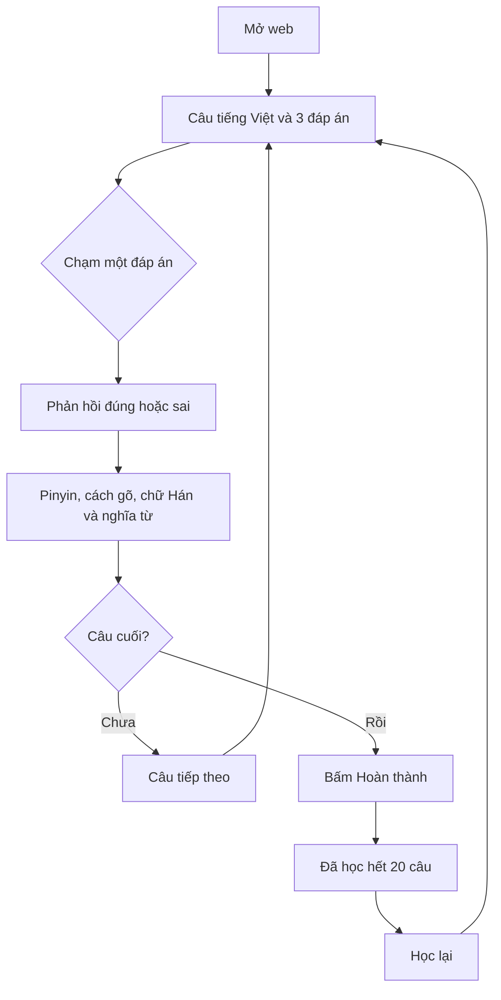

# Luồng học và use case

## Luồng chính

## Trạng thái

| Trạng thái | Hiển thị | Hành động |
| --- | --- | --- |
| Chưa trả lời | Badge loại câu, Câu n/20, câu Việt, 3 lựa chọn | Chọn một đáp án |
| Trả lời đúng | Đáp án đúng có icon/nhãn và màu xanh, lời giải | Câu tiếp theo hoặc Hoàn thành |
| Trả lời sai | Đáp án sai được đánh dấu; đáp án đúng được chỉ rõ; lời giải | Câu tiếp theo hoặc Hoàn thành |
| Hoàn thành | “Bạn đã học hết 20 câu”, nút “Học lại” | Bắt đầu lượt mới |

## UC01 — Bắt đầu

Mở route `/`, thấy ngay câu đầu. Không cần chọn chủ đề hoặc khóa học. Nội dung dùng dữ liệu tĩnh, không phụ thuộc dịch vụ chấm bài.

## UC02 — Chọn đáp án

Chạm bất kỳ vị trí nào trong hàng đáp án. Chấm ngay và khóa cả ba lựa chọn; không nhận lựa chọn thứ hai. Không tiết lộ chữ Hán, cách gõ hoặc giải nghĩa trước khi chọn.

Ví dụ câu “Anh đang ăn cơm”: các lựa chọn là `wǒ zài gōngzuò`, `wǒ zài chīfàn`, `wǒ zài máng`. Chỉ lựa chọn thứ hai đúng.

## UC03 — Hiểu lời giải

Đúng: “Đúng rồi”. Sai: “Chưa đúng — xem câu đúng nhé”. Phản hồi luôn có chữ và icon, không chỉ dựa vào màu.

Thứ tự: Pinyin chuẩn → “Gõ trên bàn phím” → chữ Hán → “Từng từ”. Ví dụ: `wǒ zài chīfàn` → `wo zai chifan` → `我在吃饭。`; `wǒ`: anh/tôi, `zài`: đang, `chīfàn`: ăn cơm.

Không mở popup chặn màn hình cho lời giải. Giữ nguyên vị trí đáp án khi chấm; cho phép cuộn tự nhiên để đọc nội dung dài.

## UC04 — Tiếp tục

Nút “Câu tiếp theo” chỉ có sau khi trả lời. Khi bấm: tăng vị trí câu đúng một lần, xóa lựa chọn/lời giải cũ, đưa vùng câu hỏi mới vào tầm nhìn. Ngăn double-tap bỏ qua câu.

Tiến độ cập nhật ngay khi trả lời: ban đầu 0/20; sau câu đầu 1/20; sau câu cuối 20/20. Nhãn vị trí “Câu n/20” là số thứ tự, khác với số đã trả lời.

## UC05 — Kết thúc và học lại

Sau khi trả lời câu 20, hiển thị lời giải và nút “Hoàn thành”. Bấm nút mới sang màn hoàn thành. “Học lại” đặt vị trí về câu 1, tiến độ 0/20 và tạo thứ tự lựa chọn mới.

## UC06 — Rời trang hoặc tải lại

Không lưu lịch sử trong MVP. Reload hoặc mở lượt mới bắt đầu lại. Không có hộp thoại yêu cầu giữ tiến độ hoặc đăng nhập.
